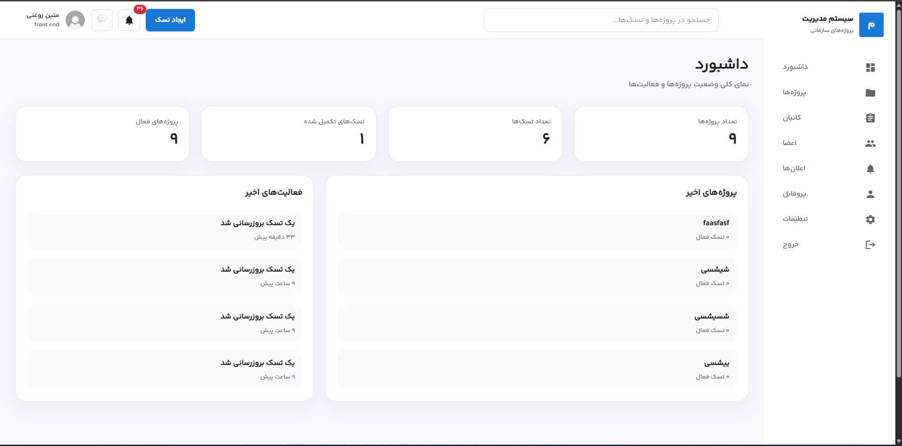

# ProjectFlow

A modern Project Management Dashboard built with **React**, **TypeScript**, and **Material UI v7**.

ProjectFlow is a responsive Single Page Application (SPA) that simulates a lightweight project management system. It allows users to create projects, manage tasks, monitor project progress, and organize workflows through a clean and responsive interface.

> **Note:** This project currently uses **Local Storage** as its data source. It is designed as a frontend-focused application without a backend.

---

## 📸 Preview



---

## ✨ Features

### 🔐 Authentication

* User Registration
* User Login
* Protected Routes
* Persistent Authentication using Local Storage

### 📊 Dashboard

* Dynamic statistics cards
* Recent projects
* Recent activities
* Project overview
* Task overview

### 📁 Project Management

* Create Project
* View All Projects
* Project Details
* Progress Calculation
* Project Statistics

### ✅ Task Management

* Create Task
* Task Details
* Task Priority
* Task Status
* Assign Task to Project
* Due Date Support

### 📌 Kanban Board

* Todo
* In Progress
* Review
* Done

The project architecture is ready for future Drag & Drop implementation.

### 🔔 Notifications

* Activity timeline
* Relative time formatting
* Dynamic notification rendering

### 🎨 User Interface

* Fully Responsive
* RTL Support
* Material UI v7
* Reusable Components
* Config-driven UI

---

# 🛠 Tech Stack

### Frontend

* React
* TypeScript
* React Router DOM
* Material UI v7

### State Management

* React Hooks
* Local Storage

### Utilities

* Intl API
* Utility Functions
* Config-based Rendering

---

# 📂 Project Structure

```text
src
├── assets
├── components
├── config
├── data
├── layouts
├── lib
├── pages
├── routes
├── services
├── styles
├── types
├── utils
└── validations
```

The project follows a modular architecture where reusable UI components, utility functions, configuration files, and business logic are separated to improve maintainability and scalability.

---

# 🚀 Key Concepts Implemented

* Component Composition
* Reusable Components
* Config-based Rendering
* Utility-based Business Logic
* Protected Routing
* Responsive Layout Design
* Type-safe Development
* Clean Folder Structure
* Local Persistence
* Dynamic Project Statistics
* Activity Timeline

---

# ⚙️ Installation

Clone the repository:

```bash
git clone https://github.com/matinroghani/project-management.git
```

Navigate to the project:

```bash
cd project-management
```

Install dependencies:

```bash
npm install
```

Start the development server:

```bash
npm run dev
```

---

# 📌 Future Improvements

- Integrate Redux Toolkit for global state management
- Replace Local Storage with a backend API
- User-specific projects and tasks
- Project member management
- Global search for projects and tasks
- Internationalization (i18n)
- Dark / Light theme switching
- Real-time notifications
- Task comments
- File attachments

---

# 🎯 Learning Objectives

This project was developed to improve practical skills in:

* React
* TypeScript
* Material UI
* Routing
* Responsive Design
* Component Architecture
* Code Reusability
* Clean Code Principles
* Frontend Project Structure

---

# 📄 License

This project is intended for educational and portfolio purposes.
